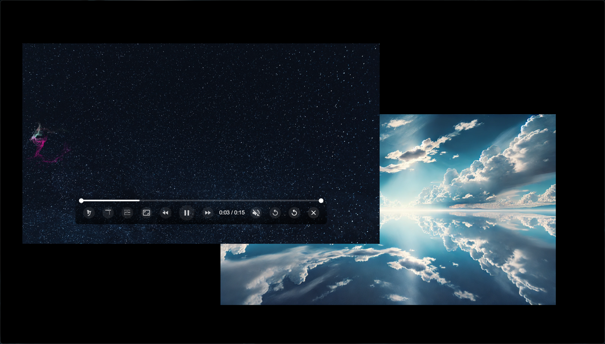
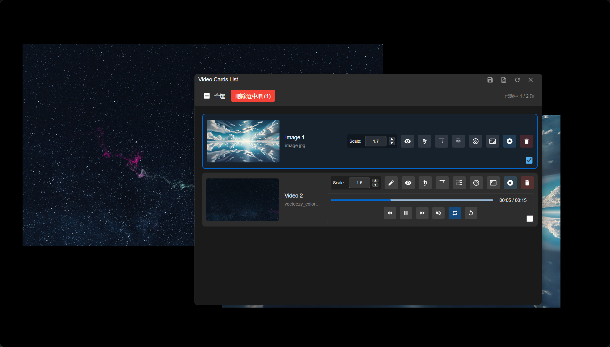
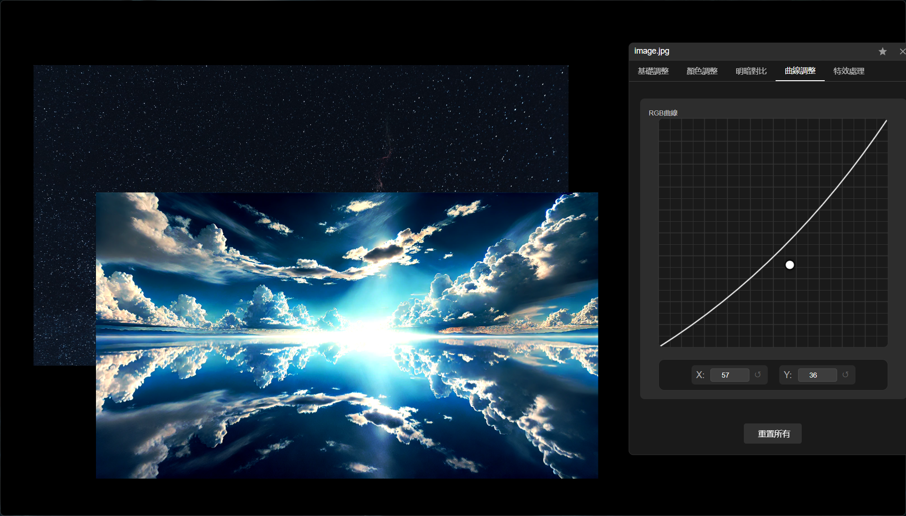
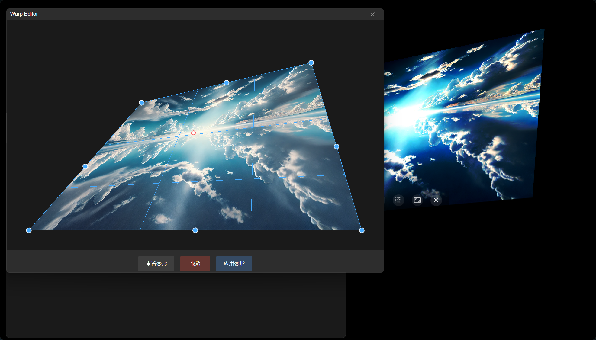

# 🚀 Visual Player

<div align="center">

[](https://github.com/yeongpin/VisualPlayer/releases/latest)
[](https://github.com/yeongpin/VisualPlayer/blob/master/LICENSE)
[](https://github.com/yeongpin/VisualPlayer/stargazers)

[🌟 English](#english) | [🌏 中文](#中文)


## Preview





</div>

---

## English

A professional multi-media workspace that supports multiple videos and images with advanced transformation and editing capabilities.

### ✨ Key Features

#### 🎬 **Multi-Media Workspace**
- **Simultaneous Multi-Video Playback**: Play multiple videos in a single workspace
- **Professional Image Display**: Support for standard and RAW image formats
- **Intuitive Drag & Drop**: Simply drag media files into the workspace
- **Synchronized Controls**: Master playback controls for all media

#### 🎨 **Advanced Transformation Tools**
- **8-Point Warp Editor**: Professional perspective correction and creative warping
  - Independent editor window for precise control
  - Real-time preview with adjustable control points
  - Non-destructive editing with reset capability
  - Seamless integration with other transforms
- **Standard Transforms**: Scale, rotate, flip X/Y with precision controls
- **Comprehensive Filter System**: RGB adjustments, brightness, contrast, saturation, hue, temperature, gamma, blur, sharpness, highlights, shadows, clarity, grain, exposure, curves
- **Layout Management**: Save and load complete workspace arrangements with all transformations
- **Video Editor**: Built-in video editing capabilities with frame-by-frame control

#### 🎛️ **Professional Controls**
- **Advanced Transcoding**: GPU hardware acceleration with intelligent fallback
- **Batch Operations**: Multi-select, batch delete, and bulk processing
- **Custom Decoder Selection**: Choose optimal decoders for your media
- **Advanced Playback Options**: Frame-by-frame control, speed adjustment, loop mode
- **Workspace Persistence**: Save complete sessions including all transformations
- **Cards Management**: Drag-and-drop card list with thumbnail previews
- **Performance Monitoring**: Real-time FPS, memory usage, and GPU monitoring
- **Multi-Language Support**: English and Traditional Chinese interfaces

#### 📁 **Format Support**
- **Video Formats**: MP4, WebM, MOV, AVI, MKV, and more
- **Standard Images**: JPG, PNG, WebP, GIF, BMP, TIFF
- **RAW Images**: 
  - Sony: ARW, SRF
  - Canon: CR2, CR3, CRW
  - Nikon: NEF, NRW
  - Adobe: DNG
  - Olympus: ORF
  - Fujifilm: RAF
  - Panasonic: RW2
  - Pentax: PEF
  - Samsung: SRW

### 🚀 Getting Started

#### Installation
1. Download the latest release from [GitHub Releases](https://github.com/yeongpin/VisualPlayer/releases)
2. Run the installer or extract the portable version
3. Launch Visual Player

#### Quick Start
1. **Load Media**: Drag and drop your videos/images into the workspace or cards window
2. **Batch Management**: Use the cards list for batch selection and operations
3. **Arrange Layout**: Position media elements as desired
4. **Apply Transforms**: Right-click any media for transformation options
5. **Use Warp Editor**: Click the warp button for 8-point perspective editing
6. **Adjust Filters**: Use professional filter controls for color grading
7. **Save Workspace**: Save your complete layout with all transforms and filters

### 🎯 Advanced Features

#### 🔄 **Transcoding & Processing**
- **Smart Transcoding Detection**: Automatic compatibility checking with 1-second detection
- **GPU Hardware Acceleration**: NVIDIA/AMD GPU support with CPU fallback
- **Format Optimization**: Intelligent conversion for web-compatible playback
- **Batch Processing**: Convert multiple files simultaneously
- **Registry Management**: Unified GUID system for multi-version compatibility

#### 🎨 **Warp Editor Workflow**
1. **Open Warp Editor**: Click the diamond-shaped warp button on any media
2. **Adjust Control Points**: Drag the 8 corner and edge control points
3. **Real-time Preview**: See changes instantly in the editor window
4. **Apply or Reset**: Save your changes or reset to original
5. **Persistent Effects**: Warp transforms are preserved with all other operations

#### 📋 **Cards Management System**
- **Thumbnail Grid View**: Visual overview of all loaded media
- **Drag & Drop**: Add files directly to cards window
- **Batch Selection**: Multi-select with Ctrl/Shift for bulk operations
- **Smart Indexing**: Dynamic index system prevents operation errors
- **Thumbnail Optimization**: Efficient loading and caching

#### 🎛️ **Advanced Filter Controls**
- **Professional Color Grading**: RGB curves, temperature, exposure control
- **Real-time Processing**: GPU-accelerated filter rendering
- **Preset System**: Save and load custom filter configurations
- **Non-destructive Editing**: All filters preserve original media quality

#### 💾 **Layout Management**
- **Complete State Persistence**: Save workspace with all transformations and filters
- **Cross-session Compatibility**: Restore layouts across application restarts
- **Export Options**: Multiple output formats for different workflows

### ⚡ Performance Optimizations

- **Multi-Instance Management**: Intelligent single/multi-instance mode switching
- **Hardware Acceleration**: GPU-accelerated rendering and transcoding
- **Memory Management**: Efficient handling of multiple large media files
- **Smart Caching**: Optimized thumbnail and preview generation
- **Non-Destructive Editing**: All transformations preserve original quality
- **Background Processing**: Smooth UI experience during intensive operations
- **Real-time Monitoring**: Live performance metrics and resource usage

---

## 中文

專業的多媒體工作空間，支持多視頻播放和圖像顯示，具備先進的變換和編輯功能。

### ✨ 主要功能

#### 🎬 **多媒體工作空間**
- **多視頻同步播放**：在單一工作空間中同時播放多個視頻
- **專業圖像顯示**：支持標準和 RAW 圖像格式
- **直覺拖放操作**：簡單拖放媒體文件到工作空間
- **同步控制**：主控制面板統一管理所有媒體

#### 🎨 **先進變換工具**
- **8 點變形編輯器**：專業透視校正和創意變形
  - 獨立編輯器窗口提供精確控制
  - 可調整控制點的即時預覽
  - 非破壞性編輯和重置功能
  - 與其他變換功能無縫整合
- **標準變換**：縮放、旋轉、X/Y 軸翻轉
- **濾鏡效果**：全面的視覺增強選項
- **佈局管理**：保存和載入自定義工作空間配置

#### 🎛️ **專業控制**
- **自定義解碼器選擇**：為媒體選擇最佳解碼器
- **高級播放選項**：逐幀控制、播放速度調整
- **工作空間持久化**：保存包含所有變換的完整會話
- **多語言支持**：英文和繁體中文界面

#### 📁 **格式支持**
- **視頻格式**：MP4、WebM、MOV、AVI、MKV 等
- **標準圖像**：JPG、PNG、WebP、GIF、BMP、TIFF
- **RAW 圖像**：
  - Sony：ARW、SRF
  - Canon：CR2、CR3、CRW
  - Nikon：NEF、NRW
  - Adobe：DNG
  - Olympus：ORF
  - Fujifilm：RAF
  - Panasonic：RW2
  - Pentax：PEF
  - Samsung：SRW

### 🚀 快速開始

#### 安裝
1. 從 [GitHub Releases](https://github.com/yeongpin/VisualPlayer/releases) 下載最新版本
2. 運行安裝程序或解壓便攜版
3. 啟動 Visual Player

#### 快速入門
1. **載入媒體**：拖放視頻/圖像文件到工作空間或卡片窗口
2. **批量管理**：使用卡片列表進行批量選擇和操作
3. **排列佈局**：根據需要定位媒體元素
4. **應用變換**：右鍵點擊任何媒體查看變換選項
5. **使用變形編輯器**：點擊變形按鈕進行 8 點透視編輯
6. **調整濾鏡**：使用專業濾鏡控制進行色彩調整
7. **保存工作空間**：保存包含所有變換和濾鏡的完整佈局

### 🎯 高級功能

#### 變形編輯器工作流程
1. **打開變形編輯器**：點擊任何媒體上的菱形變形按鈕
2. **調整控制點**：拖動 8 個角落和邊緣控制點
3. **即時預覽**：在編輯器窗口中即時查看變化
4. **應用或重置**：保存更改或重置到原始狀態
5. **持續效果**：變形變換與所有其他操作一起保持

#### 佈局管理
- **保存佈局**：保留完整的工作空間配置
- **載入佈局**：恢復包含所有變換的完整會話
- **導出選項**：多種輸出格式適用於不同工作流程

### ⚡ 性能優化

- **硬件加速**：利用 GPU 實現流暢播放和變換
- **內存管理**：高效處理多個大型媒體文件
- **非破壞性編輯**：所有變換保持原始質量
- **背景處理**：在密集操作期間保持流暢的 UI 體驗

---

## 🛠️ Technical Specifications

### System Requirements
- **OS**: Windows 10/11, macOS 10.15+, Linux (Ubuntu 18.04+)
- **RAM**: 8GB minimum (16GB recommended for 4K content)
- **GPU**: DirectX 11 compatible (dedicated GPU recommended)
- **Storage**: 500MB installation + workspace for media files

### Architecture
- **Frontend**: HTML5, CSS3, JavaScript (ES6+)
- **Backend**: Electron with Node.js
- **Media Processing**: FFmpeg, libraw for RAW images
- **Transform Engine**: Moveable.js with custom optimization
- **UI Framework**: Custom modular design system

---

## 📚 Documentation

### API Reference
- [Transform Manager API](docs/transform-manager.md)
- [Warp Editor Integration](docs/warp-editor.md)
- [Layout System](docs/layout-system.md)
- [Codec Management](docs/codec-management.md)

### Tutorials
- [Getting Started Guide](docs/getting-started.md)
- [Advanced Transforms](docs/advanced-transforms.md)
- [Custom Layouts](docs/custom-layouts.md)
- [Performance Optimization](docs/performance.md)

---

## 🤝 Contributing

We welcome contributions! Please see our [Contributing Guide](CONTRIBUTING.md) for details.

### Development Setup
```bash
# Clone the repository
git clone https://github.com/yeongpin/VisualPlayer.git

# Install dependencies
npm install

# Start development server
npm run dev

# Build for production
npm run build
```

---

## 📄 License

**AGPL-3.0**

Copyright (c) 2025 YeongPin

This program is free software: you can redistribute it and/or modify it under the terms of the GNU Affero General Public License as published by the Free Software Foundation, either version 3 of the License, or (at your option) any later version.

---

## 🙏 Acknowledgments

- [Moveable.js](https://github.com/daybrush/moveable) - For the amazing transformation engine
- [FFmpeg](https://ffmpeg.org/) - For comprehensive media format support
- [libraw](https://www.libraw.org/) - For RAW image processing capabilities
- [Electron](https://www.electronjs.org/) - For cross-platform desktop application framework

---

<div align="center">

**⭐ Star this project if you find it useful!**

[🐛 Report Bug](https://github.com/yeongpin/VisualPlayer/issues) | [🚀 Request Feature](https://github.com/yeongpin/VisualPlayer/issues) | [💬 Discussions](https://github.com/yeongpin/VisualPlayer/discussions)

</div>
